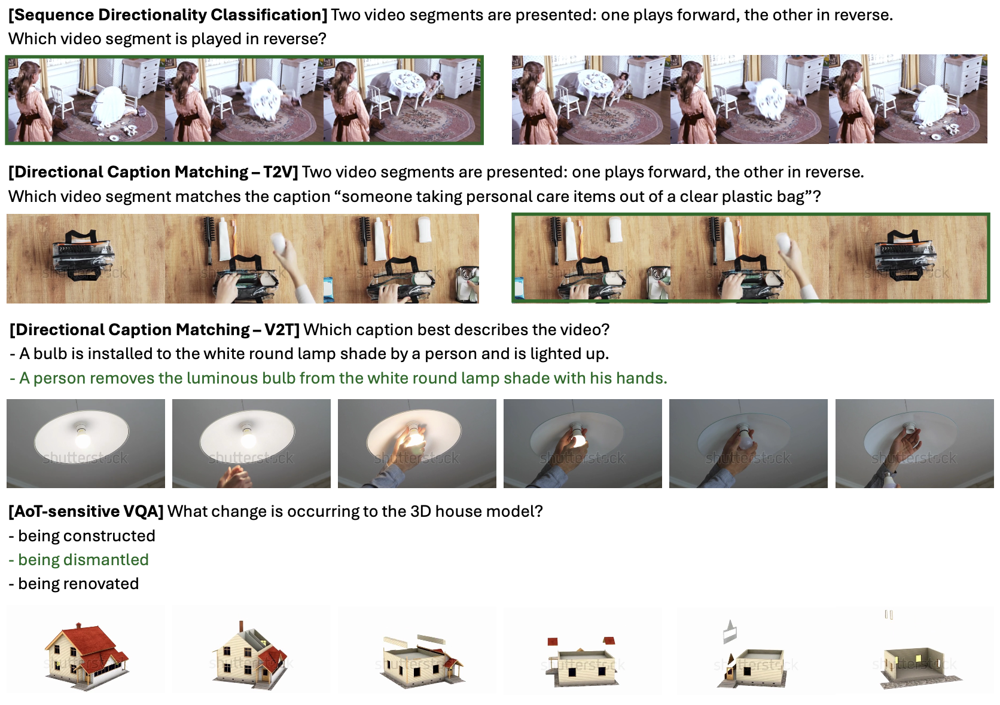

# Seeing the Arrow of Time in Large Multimodal Models
[**Seeing the Arrow of Time in Large Multimodal Models**](https://arxiv.org/pdf/2506.03340)   
Zihui Xue, Mi Luo, Kristen Grauman  
arXiv, 2025   
[project page](https://vision.cs.utexas.edu/projects/SeeAoT/) | [arxiv](https://arxiv.org/pdf/2506.03340) | [data (AoTBench)](https://huggingface.co/datasets/sherryxzh/AoTBench) | [model (ArrowRL-Qwen2.5-VL-7B)](https://huggingface.co/sherryxzh/ArrowRL-Qwen2.5-VL-7B) | [bibtex](#citation)

## AoTBench
We propose AoTBench, the first dedicated benchmark to assess temporal direction sensitivity—a core component of robust video perception—through three distinct elements. Download data [here](https://huggingface.co/datasets/sherryxzh/AoTBench) and put them under `data`.

<p align="left">
  
</p>

## Evaluation on AoTBench

### Environment Setup
Follow [Qwen2.5-VL repo](https://github.com/QwenLM/Qwen2.5-VL) for setting up the environment.
```bash
pip install transformers==4.51.3 accelerate
pip install qwen-vl-utils[decord]
```

### Inference
We provide ArrowRL-enhanced Qwen2.5-VL-7B model checkpoint [here](https://huggingface.co/sherryxzh/ArrowRL-Qwen2.5-VL-7B). Run baseline Qwen2.5-VL-7B and our ArrowRL-enhanced model on AoTBench:
```bash
bash scripts/eval.sh
```
Our default evaluation setting is 16 frames. Read results with `eval/read_qa.py`.

## Citation
If you find our work inspiring or use our codebase in your research, please consider giving a star ⭐ and a citation.

```
@article{xue2025seeing,
  title={Seeing the Arrow of Time in Large Multimodal Models},
  author={Xue, Zihui and Luo, Mi and Grauman, Kristen},
  journal={arXiv preprint arXiv:2506.03340},
  year={2025}
}
```